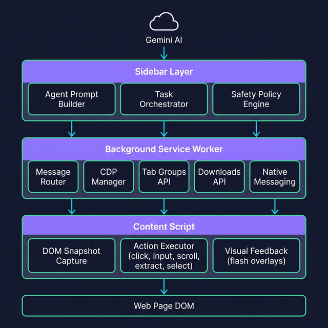
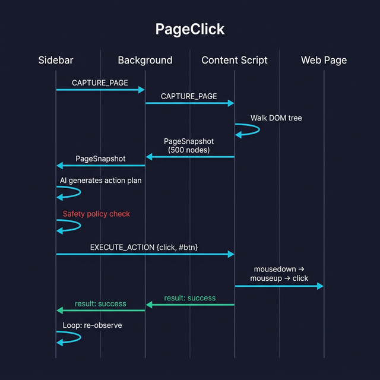

# PageClick ✨

AI-powered Chrome extension that can **see, understand, and interact** with any web page. Ask it to click buttons, fill forms, extract data, organize tabs — it does it all autonomously.


## Features

- 🤖 **Autonomous Browser Agent** — AI observes the page, plans actions, and executes them in a loop
- 🖱️ **10 Action Types** — Click, type, scroll, select, extract, navigate, eval, download, tab groups, native ops
- 🛡️ **Safety Policy Engine** — Tiered permission system (auto / confirm / checkpoint / block) with audit logging
- 🔍 **DOM Snapshot Capture** — Captures up to 500 interactive & semantic elements with CSS selectors
- 🧪 **Chrome DevTools Protocol** — Runtime JS evaluation, network monitoring, console capture
- 📁 **Tab Group Management** — AI can organize browser tabs into color-coded groups
- 💬 **Streaming Chat UI** — Real-time token-by-token responses with dark theme
- 📋 **Clipboard & File Access** — Native messaging bridge for local operations

## Tech Stack

| Layer         | Technology                                          |
| ------------- | --------------------------------------------------- |
| Frontend      | React 19, TypeScript, Vite                          |
| Styling       | Vanilla CSS (Inter font, glassmorphism)             |
| Backend       | Supabase Edge Functions (Deno)                      |
| AI Models     | NVIDIA API (Kimi K2.5), Groq API (GPT-OSS-20B)     |
| Extension     | Chrome Manifest V3, Side Panel API                  |
| Automation    | Content Scripts, Chrome DevTools Protocol (CDP)     |
| Safety        | Policy engine with blocklists + risk escalation     |

## Architecture

PageClick uses a **3-layer architecture** with Chrome's message passing system:



### Layer Breakdown

**Sidebar Layer** — The brain of the extension
- `agentPrompt.ts` — Builds phase-aware prompts for the AI (clarification, execution, info)
- `taskOrchestrator.ts` — State machine driving the observe → plan → act → re-observe loop (max 15 iterations)
- `safety-policy.ts` — Evaluates every action against blocklists & risk rules before execution

**Background Service Worker** — The router and API gateway
- `background.ts` — Routes messages between sidebar ↔ content scripts, handles navigate/download/tabgroup/native actions
- `cdpManager.ts` — Manages Chrome DevTools Protocol sessions for JS eval, network monitoring, and console capture

**Content Script** — The hands of the extension
- `capture-dom.ts` — Walks the DOM tree, captures up to 500 interactive/semantic elements with bounding boxes and CSS selectors
- `action-executor.ts` — Executes click, input, scroll, select, extract actions directly on the page with visual feedback

### Action Execution Flow



The agentic loop works as follows:

1. **Observe** — Content script captures a DOM snapshot (interactive elements, text, attributes)
2. **Plan** — AI receives the snapshot + action history and generates exactly **one action**
3. **Safety Check** — Policy engine evaluates the action (auto-allow, require confirmation, or block)
4. **Act** — Action is executed via content script (DOM actions) or background (Chrome APIs)
5. **Re-observe** — Fresh snapshot captured, loop repeats until task is complete

## Supported Actions

| Action       | Executor          | Description                                              |
| ------------ | ----------------- | -------------------------------------------------------- |
| `click`      | Content Script    | Full mouse event sequence (mousedown → mouseup → click)  |
| `input`      | Content Script    | Character-by-character typing with keyboard events       |
| `select`     | Content Script    | Native `<select>` or custom dropdown selection           |
| `scroll`     | Content Script    | Window scroll (up/down/top/bottom) or scrollIntoView     |
| `extract`    | Content Script    | Read text/value from any element                         |
| `navigate`   | Background        | `chrome.tabs.update()` — works from any page             |
| `eval`       | Background (CDP)  | `Runtime.evaluate` via Chrome DevTools Protocol          |
| `download`   | Background        | `chrome.downloads.download()` API                        |
| `tabgroup`   | Background        | `chrome.tabs.group()` — create/add/list tab groups       |
| `native`     | Background        | `chrome.runtime.sendNativeMessage()` — clipboard & files |

## Safety & Security

Every action passes through the safety policy engine before execution:

| Tier           | Behavior                    | Example Triggers                              |
| -------------- | --------------------------- | --------------------------------------------- |
| **Auto**       | Executes immediately        | Low-risk clicks, scrolls, extracts            |
| **Confirm**    | Requires user approval      | Delete buttons, form submissions, medium risk  |
| **Checkpoint** | Pauses the entire task      | "Place Order", "Pay Now", "Confirm Payment"   |
| **Block**      | Action rejected entirely    | Password fields, CC inputs, banking URLs      |

**Blocklists include:** Password/OTP/MFA fields, credit card inputs, `.stripe` elements, `paypal.com`, `chrome://` pages, and more.

Sensitive fields (passwords, credit card numbers) are automatically **redacted** from DOM snapshots and never sent to the AI.

## Project Structure

```
PageClick/
├── public/
│   └── manifest.json              # Chrome extension manifest (MV3)
├── src/
│   ├── background.ts              # Service worker — message routing hub
│   ├── background/
│   │   └── cdpManager.ts          # Chrome DevTools Protocol manager
│   ├── content/
│   │   ├── capture-dom.ts         # DOM snapshot capture + redaction
│   │   └── action-executor.ts     # Action execution engine
│   ├── shared/
│   │   ├── messages.ts            # Type definitions for all messages
│   │   └── safety-policy.ts       # Safety policy engine + audit trail
│   ├── sidebar/
│   │   ├── App.tsx                # Main app with agentic loop
│   │   ├── components/
│   │   │   ├── SearchBox.tsx      # Input + model selector
│   │   │   ├── ChatView.tsx       # Message bubbles + streaming
│   │   │   ├── ActionPlanView.tsx # Visual action plan display
│   │   │   ├── Header.tsx         # Top bar
│   │   │   └── BottomNav.tsx      # Navigation tabs
│   │   ├── utils/
│   │   │   ├── agentPrompt.ts     # AI prompt builder (phase-aware)
│   │   │   ├── taskOrchestrator.ts # Agentic loop state machine
│   │   │   └── pageScanAnimation.ts # Page scan visual effects
│   │   └── styles/
│   │       └── index.css          # Full dark theme stylesheet
│   └── lib/
│       └── g4f-client.js          # AI client library
├── docs/
│   └── images/                    # Architecture diagrams
├── sidebar.html                   # Extension side panel entry
└── vite.config.ts                 # Build config
```

## Getting Started

### Prerequisites

- Node.js 18+
- A Supabase project with `KIMI_API_KEY` and `GROQ_API_KEY` in Edge Function secrets

### Install & Dev

```bash
git clone https://github.com/RahulMirji/PageClick.git
cd PageClick
npm install
npm run dev
```

### Build for Chrome

```bash
npm run build
```

Then load `dist/` as an unpacked extension in `chrome://extensions`.

## License

MIT
